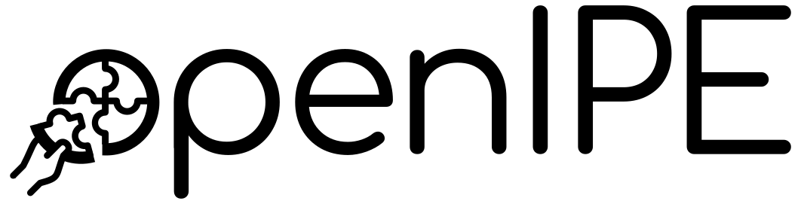

<center>

</center>

---

# openIPE: An Extensible Memory Isolation Framework for Microcontrollers
[](https://github.com/martonbognar/openipe/actions/workflows/ci.yaml)
 [](https://opensource.org/licenses/BSD-3-Clause)
 [](https://ghcr.io/martonbognar/openipe)

This repository contains [openIPE](https://mici.hu/papers/bognar25openipe.pdf), a microcontroller design based on [openMSP430](https://github.com/olgirard/openmsp430), implementing Texas Instruments' [Intellectual Property Encapsulation (IPE)](https://www.ti.com/lit/an/slaa685/slaa685.pdf#page=9) memory isolation feature and featuring a firmware layer that can be used to implement various security-critical features.
Aside from the source code of the microcontroller and applications, the repository contains a unit-test suite and uses a symbolic-execution tool to validate properties of either IPE application or firmware code.

If you extend or improve upon our work, please consider submitting a pull request and cite openIPE as the following:

```bibtex
@inproceedings{bognar25openipe,
  title     = {{openIPE}: An Extensible Memory Isolation Framework for Microcontrollers},
  author    = {Bognar, Marton and Van Bulck, Jo},
  year      = 2025,
  booktitle = {10th {IEEE} European Symposium on Security and Privacy (EuroS{\&}P)},
}
```

For a complete introduction to this work, we also strongly encourage reading our [EuroS&P'25 paper](https://mici.hu/papers/bognar25openipe.pdf).

## Installation

### Docker setup
We recommend using [Docker](https://www.docker.com/).
This latest container image containing all dependencies and setup code can be retrieved as follows:

```
$ docker pull ghcr.io/martonbognar/openipe:latest
```

Once the image is pulled, you can start a new instance with the `core` directory mounted as a volume.
This will allow you to edit the source files on your own machine and execute scripts on them inside the container.

```shell
$ docker run -it -v ./core:/openipe/core openipe:latest /bin/bash

```
### Docker compose setup
You can also use [Docker Compose](https://docs.docker.com/compose/) to set up the development environment.
See the provided `docker-compose.yaml` file for an example configuration.
You can start and a new container with the following command:
```shell
$ docker compose up -d
```
You can then access the container's shell with:
```shell
$ docker exec -it openipe /bin/bash
```

### Manual setup
Alternatively, you can follow the steps in the [Dockerfile](Dockerfile) to set up the dependencies on your own machine.

## Basic functionality

To enable easy reproduction of the most important results and to provide an easy way of getting started with the codebase, we provide top-level scripts in the `openipe` directory of the Docker image (and the root of this repository).
These scripts can be used as a starting point for running more advanced examples and are detailed in the following sections.

### Unit test suite

#### Regression tests

Run `./scripts/regression_tests.sh` to execute the original regression tests of openMSP430.
This test will finish with an overview table and a report of the number of successful and unsuccessful tests.

#### Isolation test suite

Run `./scripts/isolation_tests.sh` to execute the unit tests we added to validate the security guarantees added by our extensions and the interrupt case study.
This script performs two steps:
First, it runs the tests as expected, where it is validated that no leakage occurs.
Then, it runs some tests without the hardware fixes proposed in IPE Exposure to validate that this re-enables some vulnerabilities.

During the execution of the case study tests (#24-26), overhead measurements for the interrupt latencies are also provided.


```shell
$ ./scripts/isolation_tests.sh
...
#===================================================================#
#                            SUMMARY REPORT                         #
#===================================================================#

         +-----------------------------------
         | Number of PASSED  tests : 26
         | Number of SKIPPED tests : 0
         | Number of FAILED  tests : 0
         | Number of ABORTED tests : 0
         |----------------------------------
         | Number of tests         : 26
         +----------------------------------

...
```

### Software development framework workflow

The example `./scripts/framework_hello.sh` demonstrates how to apply our mitigation framework to C projects and run them on openIPE.
This script runs the framework on a simple hello world C IPE project then executes it in the simulator, obtaining some performance measurements.

### Attestation case study

The script `./scripts/framework_attestation.sh` runs the framework on the attestation code adapted from VRASED and runs it on openIPE, reporting on the total number of cycles elapsed.

### Symbolic validation

The following scripts run the [Pandora](https://github.com/pandora-tee/pandora) symbolic execution tool on openIPE binaries.
These scripts operate on the `pmem.elf` and `bmem.elf` binaries located in the `core/sim/rtl_sim/run` directory, i.e., they will analyze the last program that was run on the simulator.
For example, you can run `./scripts/framework_hello.sh` first to generate the simple hello world IPE application binary.

The script `./scripts/symbolic_ipe.sh` performs the security validation if the binary contains a valid IPE region, while `./scripts/symbolic_firmware.sh` will validate the firmware code.

The pandora reports will be stored in the `logs/symbolic_ipe/` and `logs/symbolic_firmware/` directories, respectively. If you use the docker compose or manually map the volumes, you will be able to access these logs on your host machine and open them in a browser.

## Extending the codebase

The following is a non-exhaustive list of the most important directories and files that are relevant for the memory isolation implementation and the security evaluation.

- [`core/rtl/verilog`](core/rtl/verilog): contains the source files for the HDL implementation. Newly introduced files or files with notable changes are `periph/ipe_periph.v`, `omsp_frontend.v`, `omsp_mem_backbone.v`, `openMSP430.v`.
- [`core/sim/rtl_sim/bin/ipe_linker.x`](core/sim/rtl_sim/bin/ipe_linker.x): linker script used for IPE support.
- [`core/sim/rtl_sim/bin/ipe_macros.asm`](core/sim/rtl_sim/bin/ipe_macros.asm): utility scripts for the software development framework.
- [`core/sim/rtl_sim/run/run_ipe`](core/sim/rtl_sim/run/run_ipe): script to run IPE unit tests.
- [`core/sim/rtl_sim/src-c/framework`](core/sim/rtl_sim/src-c/framework): our software framework adapted from IPE Exposure.
- [`core/sim/rtl_sim/src-c/ipe-hello`](core/sim/rtl_sim/src-c/ipe-hello): IPE hello world project in C.
- [`core/sim/rtl_sim/src-c/ipe-hmac`](core/sim/rtl_sim/src-c/ipe-hmac): software attestation case study.


### Making firmware modifications

One of the most important features of openIPE is the extensible firmware.
You can find the firmware implementing the IPE bootcode in [`core/sim/rtl_sim/src/ipe/bootcode.s43`](core/sim/rtl_sim/src/ipe/bootcode.s43), and the version extended to implement the FW-IRQ secure interrupt scheme in [`core/sim/rtl_sim/src/ipe/bootcode-fw-irq.s43`](core/sim/rtl_sim/src/ipe/bootcode-fw-irq.s43).
In the [IPE unit test file](core/sim/rtl_sim/run/run_ipe) we added additional options to switch between different firmware implementations.
Finally, the [openIPE linker script](core/sim/rtl_sim/bin/ipe_linker.x) and the [assembly macros](core/sim/rtl_sim/bin/ipe_macros.asm) contain useful options for firmware modifications.

## Support

In case of suggestions or questions, please open a pull request or an issue!

## License

openIPE is based on the excellent [openMSP430](https://github.com/olgirard/openmsp430) core and is released under a BSD-3-Clause license.
